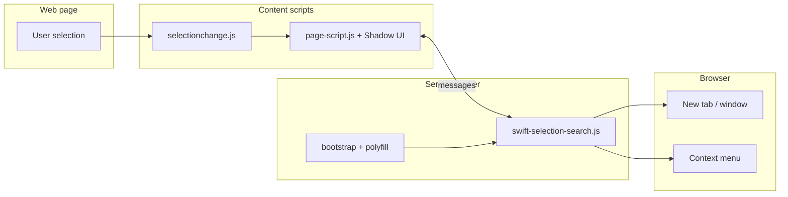

<!-- README engineered for GitHub: alerts, Mermaid, <details>, badges, footnotes, kbd. Clone the energy, not the bytes. -->

<div align="center">

# Swift Selection Search

### *Chromium edition · Manifest V3 · chef’s-kiss UX*

[](LICENSE)
[](https://developer.chrome.com/docs/extensions/mv3/intro/)
[](https://www.typescriptlang.org/)
[](https://brave.com/)

**Highlight text → a floating deck of search engines appears. Right‑click still cooks. You steer every pixel.**

[Upstream DNA](https://github.com/CanisLupus/swift-selection-search) · [This fork](https://github.com/AlexRabbit/Swift-Selection-Search-Chromium)

</div>

```
    ╭────────────────────────────────────────────╮
    │  SSS   S e l e c t   →   S u r f a c e     │
    │      shadow popup · context menu · MV3   │
    ╰────────────────────────────────────────────╯
```

> [!TIP]
> **Zero store gatekeeping.** Build once, load unpacked, own your extension ID. You are the release channel.

---

## Why this README hits different

| GitHub trick | Where we use it |
|:-------------|:----------------|
| **Alerts** (`[!NOTE]` … `[!CAUTION]`) | Install pitfalls, CSP reality, permission honesty |
| **Mermaid** | Live diagram — selection → scripts → tabs |
| **`<details>`** | Per‑browser extension URLs (Brave / Chrome / Edge) |
| **`<kbd>`** | Actual keys & chrome‑pages you’ll mash |
| **Footnotes** | Tiny asides without cluttering the main flow [^stack] |
| **Badges (shields)** | Version story at a glance (see banner) |

---

## The feature matrix (actually opulent)

| Surface | What you get |
|:--------|:-------------|
| **Popup choreography** | Auto on select, keyboard‑only, <kbd>Alt</kbd>‑hold gate, middle‑click margin mode, or popup off with **engine shortcuts still live**. |
| **Visual sauce** | Grid density, hover physics, custom CSS injection inside a **closed Shadow DOM** — reads premium, fights page CSS less. |
| **Context menu** | Full engine roster on selection; left / middle / right click policies **per your vibe**. |
| **URL alchemy** | `{searchTerms}`, `{hostname}`, `{href}`, slices, regex pipelines, alternate encodings — background worker wields **iconv-lite** so legacy charsets don’t fold. |
| **Engine groups** | One gesture → multiple searches; tab ordering that doesn’t gaslight your tree‑style tab enjoyers. |
| **Site blocklist** | Regex or glob lines; optional **tabs** permission so URLs resolve honestly. |
| **Backup / restore** | JSON in / JSON out; optional **downloads** gate for disk export. |

> [!IMPORTANT]
> **MV3 trade‑off:** legacy **blocking `webRequest`** CSP surgery is gone. We lean on Shadow DOM + injection timing; hyper‑strict CSP pages may behave differently than ancient Firefox MV2 builds. That’s physics, not neglect.

---

## Architecture (one glance, then you’re dangerous)



---

## Chromium install playbook (the part you came for)

### Prerequisite: build the extension once

```bash
git clone https://github.com/AlexRabbit/Swift-Selection-Search-Chromium.git
cd Swift-Selection-Search-Chromium
npm install
npm run build
```

> [!NOTE]
> **`npm run dist`** also exists — it emits `release/swift-selection-search-brave.zip` (no `.ts` sources inside). Unzip → load the **folder** that contains `manifest.json`, not the `.zip` itself.

### The universal 4‑beat (every Chromium cousin)

1. Open your browser’s **extensions** page (see collapsible cheat‑sheet below).
2. Toggle **Developer mode** **ON** (usually top‑right).
3. Click **Load unpacked**.
4. Pick the folder whose **root** contains **`manifest.json`** — either the repo’s **`src`** directory **or** the unzipped dist folder.

Then: pin the icon, open **Options**, tune engines, go outside and touch grass (optional).

<details>
<summary><strong>Brave</strong> — extensions URL & icon path</summary>

| Step | Action |
|:-----|:-------|
| Open extensions | Paste <kbd>brave://extensions</kbd> in the address bar |
| Developer mode | Top‑right switch |
| Load target | Repo: <code>…/Swift-Selection-Search-Chromium/<strong>src</strong></code> **or** unzipped dist folder |
| Options | <kbd>brave://extensions</kbd> → **Details** on SSS → **Extension options** |

</details>

<details>
<summary><strong>Google Chrome</strong> — same ritual, different incantation</summary>

| Step | Action |
|:-----|:-------|
| Open extensions | <kbd>chrome://extensions</kbd> |
| Developer mode | Enable |
| Load unpacked | Point at the same **`src`** (or unzipped release) |

</details>

<details>
<summary><strong>Microsoft Edge</strong> — Chromium core, Windows polish</summary>

| Step | Action |
|:-----|:-------|
| Open extensions | <kbd>edge://extensions</kbd> |
| Developer mode | Bottom‑left **Developer mode** toggle (UI varies slightly by version) |
| Load unpacked | Same folder rules as above |

</details>

> [!CAUTION]
> **Chrome Web Store / Edge Add‑ons** distribution is **not** this README’s path — that needs packaging, signing, and store accounts. Here you ship **unpacked** or **self‑hosted zip** like a civilized power user.

---

## NPM scripts (copy‑pasteable)

| Command | Effect |
|:--------|:-------|
| `npm run build` | `tsc` for `src/` + esbuild test bundle |
| `npm run watch` | Live `tsc` while you hack |
| `npm test` | Headless URL‑variable suite (tsx) |
| `npm run dist` | **`release/swift-selection-search-brave.zip`** — portable artifact |
| `npm run check` | `build` then `test` — CI‑shaped sanity |

Browser visual harness (after build): open **`tests/tests.html`**.

---

## Permissions (no corporate euphemisms)

| Permission | Why it exists |
|:-----------|:--------------|
| `storage` | Your engines & theme config survive restarts |
| `scripting` | MV3‑legal injection at **document start** |
| `webNavigation` | Re‑inject when frames actually exist |
| `contextMenus` | Right‑click search runway |
| `search` | Optional import of browser search providers |
| `clipboardWrite` | Clipboard engines & helpers |
| `<all_urls>` | Host access — the popup can’t read what it can’t reach |

**Optional (on‑demand):** `tabs` (blocklist truth), `downloads` (export to disk).

---

## Troubleshooting (speedrun)

| Symptom | Fix |
|:--------|:----|
| Blank error on load | Run `npm run build` — every `*.ts` needs its `*.js` sibling in **`src/`** |
| Wrong folder picked | `manifest.json` and `service-worker-bootstrap.js` must sit **side‑by‑side** at the root you select |
| Popup ghosting | Check **Options** → opening mode isn’t **Off**; verify blocklist |
| Tests whine | `npm test` — read the `FAIL` diff |

---

## Credits

Original **Swift Selection Search** — **Daniel Lobo** ([@CanisLupus](https://github.com/CanisLupus)) — MIT.  
This **Chromium MV3** fork — **AlexRabbit** lineage — same license spine.

---

<div align="center">

**Select less context menu. Select more internet.**

<sub>README flavor text is MIT‑licensed vibes. The code is MIT‑licensed code. Be both.</sub>

</div>

[^stack]: **Stack snapshot:** TypeScript → classic emit for the worker chain · Mozilla **webextension-polyfill** · **esbuild** for the browser test bundle · **archiver** for the Brave‑ready zip. If that’s not “current‑year tooling,” your year might be mis‑patched.
